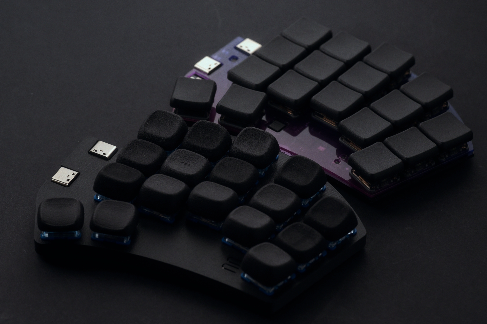

> [!WARNING]
> work in progress

# RAII

RAII is a customized variant of [waffle87/sweep](https://github.com/waffle87/sweep) featuring splayed columns and various PCB and footprint updates.

## Modifications

* Applied splay to the ring and pinky columns
* Added an additional BOOTSEL button footprint for alternative cases
* Removed the tenting puck mount
* Replaced solder-only switch footprints with Kailh hotswap ONLY sockets
* Added support for Kailh Choc V2
* Added cute ferris

## Links

* [/cases](./cases)
* [/pcb](./pcb)
* [/plate](./plate)
* [firmware](#)

## License

[SOLDERPAD HARDWARE LICENSE VERSION 2.1](./LICENSE)
