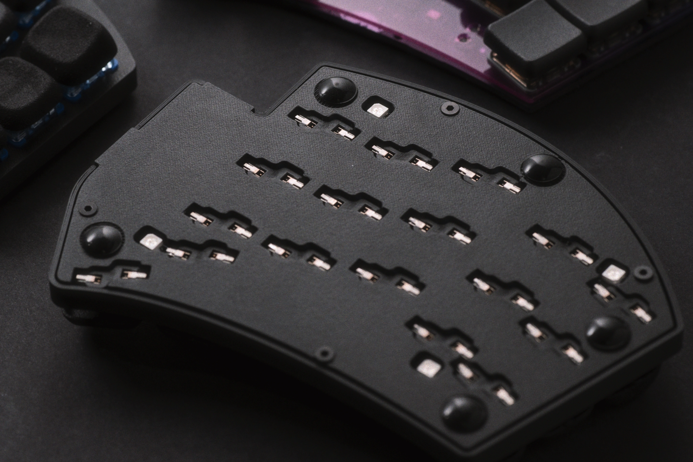
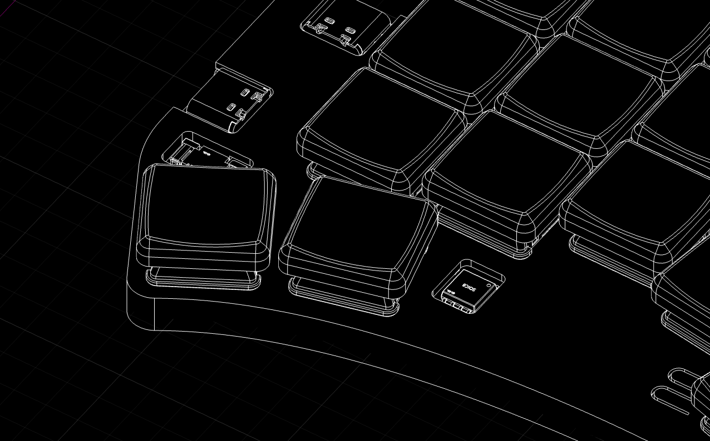
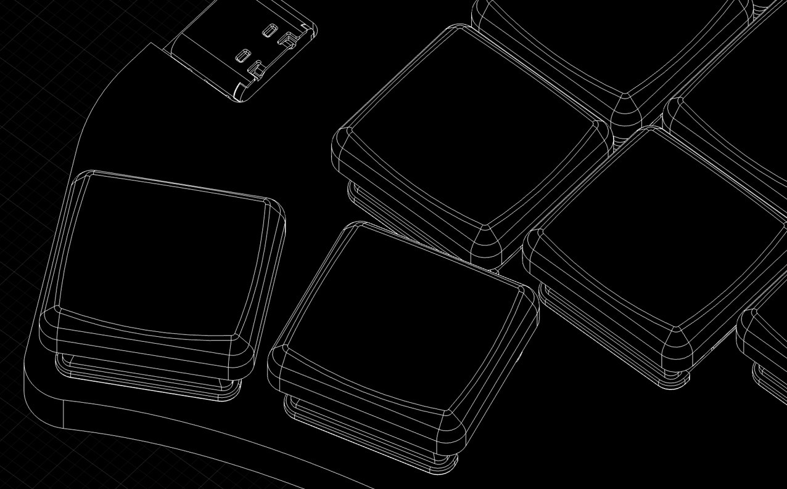

# RAII Cases

All case variants use the same bottom case. Make sure to distinguish between the left and right sides.

It has only been tested with FDM printing and was designed specifically with FDM in mind.

## Recommended Version

All PCB components are placed on the top side, but a few of them sit slightly lower than the height of the Kailh Choc switch plate's top face. Because of this, creating a perfectly enclosed top cover is challenging. Components such as the Flash memory and the display connector may still end up exposed.

- files: `top_left_opened.step` and `top_right_opened.step`

## Fully Enclosed Version

This version hides all components (excluding the USB-C receptacle) under a very thin wall. It is optimized for FDM printing.  
Due to the thinness and the nearly contacted height, the cover may bulge during assembly or when removing it from the build plate.

It is recommended to print at least two layers of 0.08 mm.

- files: `top_left_closed.step` and `top_right_closed.step`

## BOM for Assembly

- Rubber feets (≤ 9 mm Diameter), 10 pcs  
- M2 countersunk screws, 5 mm length, 8 pcs  

## Assembly Notes

Insert the switches into the case first, then attach the PCB afterward.  
(Verify switch pin orientation.)  
Attaching the switches and PCB together before inserting them may damage the thin case walls.

This case does not use threaded inserts. Screws are driven directly into the plastic.  
Do not overtighten the screws when assembling the case.
