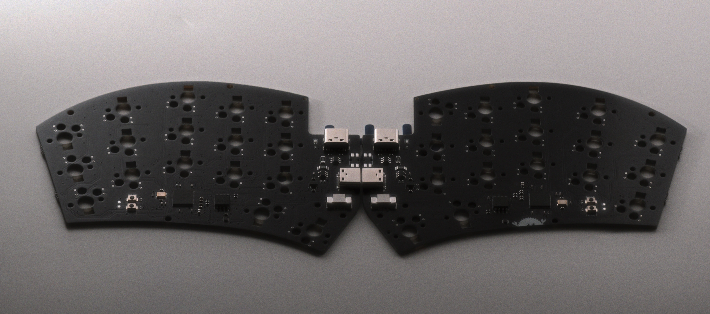
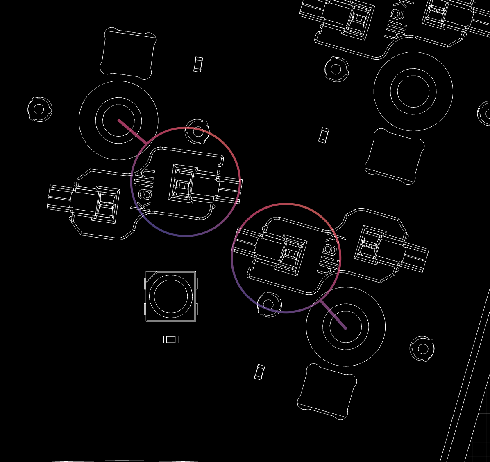

# RAII PCB

## Ordering

TODO

## Hotswap Socket Orientation

If you plan to solder the hotswap sockets yourself, orient the socket so that the rectangular portion faces the center of the switch (the switch center hole).
This orientation is recommended for proper case compatibility.
