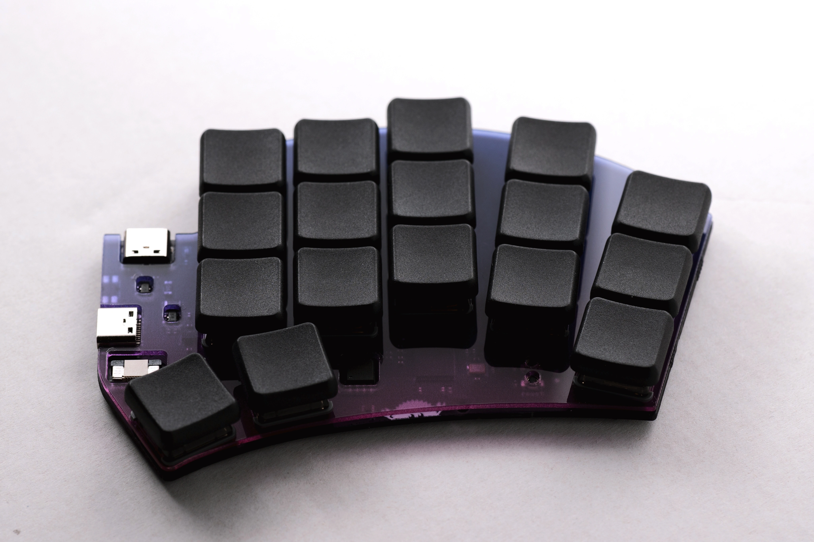

# RAII Plate

Since this design relies on hotswap sockets, it is recommended to use a plate if you are not using a case.  
There are no standoffs, but the plate should still provide meaningful support.

Because plates are typically intended for flat CNC or laser cutting, some components will inevitably remain exposed.

## Notes

The recommended plate thickness for Choc switches is 1.2 mm.

## Gradient Tint?

Some acrylic fabrication services offer gradient-tinted coloring for cut parts.  
It is difficult to recommend a specific vendor, but platforms like Taobao often have various suppliers that provide this option.
